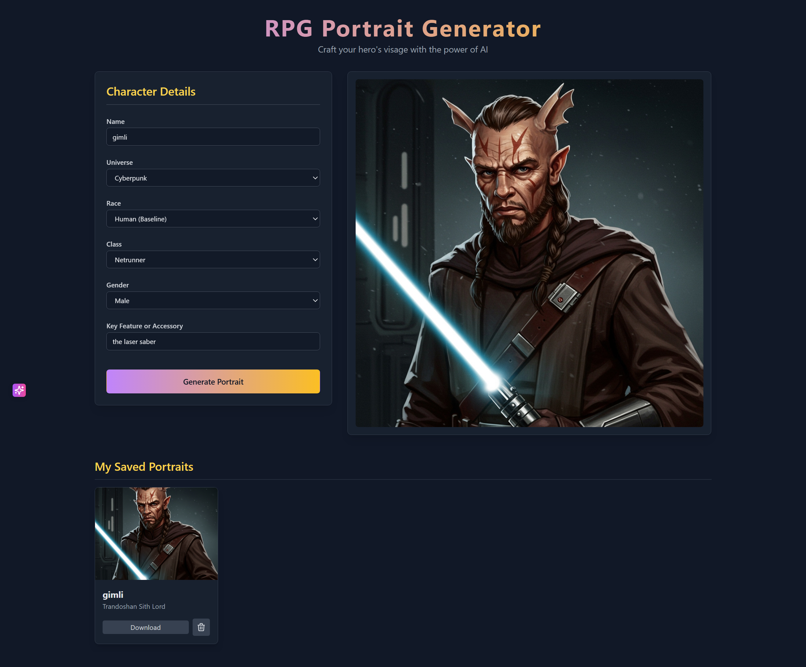

# 🎭 RPG Portrait Generator

> Generate stunning AI-powered character portraits for your tabletop RPG campaigns across multiple fantasy and sci-fi universes!

[](https://rpg-portrait-generator-147726047063.us-west1.run.app/)
[](https://reactjs.org/)
[](https://www.typescriptlang.org/)
[](https://vitejs.dev/)

## ✨ Features

- 🎨 **AI-Powered Generation** - Uses Google Gemini's Imagen 3.0 for high-quality character portraits
- 🌍 **10 Unique Universes** - From classic D&D to cyberpunk, each with authentic art styles
- 🎭 **Diverse Character Options** - Multiple races, classes, and genders per universe
- 💾 **Portrait Gallery** - Save, view, and manage your generated characters
- 📱 **Responsive Design** - Works seamlessly on desktop and mobile
- ⚡ **Fast Generation** - Optimized with Vite for quick builds and hot reloading

## 🎮 Supported Universes

| Universe | Races | Classes | Art Style |
|----------|-------|---------|-----------|
| **Forgotten Realms (D&D)** | Human, Elf, Dwarf, Halfling, Dragonborn, Tiefling, Gnome, Half-Orc | Fighter, Wizard, Rogue, Cleric, Ranger, Barbarian, Paladin, Sorcerer, Warlock, Monk, Druid, Bard | Classic high fantasy, D&D art style |
| **Lord of the Rings** | Man, Elf, Dwarf, Hobbit, Orc | Ranger, Elven Archer, Dwarven Warrior, Wizard (Istari), Rider of Rohan, Gondorian Soldier | Epic, gritty, Peter Jackson inspired |
| **Star Wars** | Human, Twi'lek, Wookiee, Zabrak, Rodian, Mon Calamari, Chiss, Trandoshan | Jedi Knight, Sith Lord, Bounty Hunter, Smuggler, Republic Trooper, Imperial Agent, Mandalorian Warrior | Sci-fi fantasy, cinematic concept art |
| **Cyberpunk** | Human (Baseline), Augmented Human, Full-Borg, Android | Netrunner, Solo, Techie, Corporate, Fixer, Rockerboy | Neon-drenched, dystopian, Blade Runner aesthetic |
| **Warhammer 40k** | Human, Space Marine, Eldar, Ork, T'au, Necron | Imperial Guardsman, Commissar, Inquisitor, Astartes Captain, Farseer, Warboss, Fire Warrior, Overlord | Grimdark, gothic, baroque armor |
| **The Witcher** | Human, Witcher, Elf (Aen Seidhe), Dwarf | Monster Slayer, Sorceress, Knight, Scoia'tael Archer, Skellige Raider, Mage | Dark medieval fantasy, Slavic folklore |
| **The Elder Scrolls** | Nord, Imperial, Breton, Redguard, High Elf, Wood Elf, Dark Elf, Orc, Khajiit, Argonian | Dragonborn, Battlemage, Nightblade, Crusader, Spellsword, Thief, Companion Warrior, Mage | High fantasy, vibrant, Skyrim inspired |
| **Cthulhu Mythos** | Human | Investigator, Professor, Cultist, Detective, Doctor, Journalist, Librarian | 1920s horror, Lovecraftian, film noir |
| **World of Warcraft** | Human, Orc, Night Elf, Undead, Tauren, Gnome, Troll, Dwarf, Blood Elf, Draenei | Warrior, Mage, Warlock, Priest, Druid, Hunter, Shaman, Death Knight, Paladin, Rogue | Stylized high fantasy, vibrant, Blizzard style |
| **Shadowrun** | Human, Elf, Dwarf, Ork, Troll | Street Samurai, Decker, Rigger, Mage, Shaman, Face | Cyberpunk meets fantasy, neon and magic |

## 🖼️ Demo

**Try the live demo:** [rpg-portrait-generator-147726047063.us-west1.run.app](https://rpg-portrait-generator-147726047063.us-west1.run.app/)

### Example Generated Portrait


*Generated Dwarven warrior in the Lord of the Rings universe*

Create portraits like this in seconds! Simply:
1. Choose your universe (Lord of the Rings, D&D, Star Wars, etc.)
2. Select race and class
3. Add character details
4. Generate with AI
5. Save to your personal gallery

## 🚀 Quick Start

### Prerequisites

- **Node.js** (v16 or higher)
- **Google Gemini API Key** ([Get one here](https://ai.google.dev/))

### Installation

1. **Clone the repository**
   ```bash
   git clone https://github.com/yourusername/rpg-portrait-generator.git
   cd rpg-portrait-generator
   ```

2. **Install dependencies**
   ```bash
   npm install
   ```

3. **Set up environment variables**
   ```bash
   cp .env.example .env.local
   ```
   
   Edit `.env.local` and add your Gemini API key:
   ```env
   GEMINI_API_KEY=your_actual_api_key_here
   ```

4. **Start the development server**
   ```bash
   npm run dev
   ```

5. **Open your browser**
   Navigate to `http://localhost:5173`

## 🛠️ Available Scripts

- `npm run dev` - Start development server with hot reloading
- `npm run build` - Build for production
- `npm run preview` - Preview production build locally

## 🔧 Configuration

### Environment Variables

Create a `.env.local` file in the root directory:

```env
# Google Gemini API Key (required)
GEMINI_API_KEY=your_gemini_api_key_here
```

### API Setup

1. Visit [Google AI Studio](https://ai.google.dev/)
2. Create a new project or select existing one
3. Generate an API key for Gemini
4. Add the key to your `.env.local` file

## 📁 Project Structure

```
rpg-portrait-generator/
├── components/           # React components
│   ├── ui/              # Reusable UI components
│   ├── PortraitDisplay.tsx
│   └── SavedPortraitsGallery.tsx
├── services/            # API services
│   └── geminiService.ts # Gemini AI integration
├── App.tsx             # Main application component
├── constants.ts        # Universe and character data
├── types.ts           # TypeScript type definitions
├── index.tsx          # Application entry point
└── vite.config.ts     # Vite configuration
```

## 🎯 How It Works

1. **Character Creation**: Select universe, race, class, and customize features
2. **AI Generation**: Sends styled prompts to Google Gemini's Imagen 3.0
3. **Portrait Rendering**: Receives and displays high-quality character artwork
4. **Gallery Management**: Save favorites and manage your character collection

## 🔒 Security Features

- ✅ Environment variables for API keys
- ✅ No hardcoded secrets in source code  
- ✅ Proper `.gitignore` configuration
- ✅ Client-side API key handling
- ✅ Error handling for missing credentials

## 🎨 Customization

### Adding New Universes

Edit `constants.ts` to add new universes:

```typescript
[Universe.YourUniverse]: {
  races: ['Race1', 'Race2'],
  classes: ['Class1', 'Class2'],
  style: 'Your unique art style description'
}
```

### Modifying Art Styles

Each universe has a `style` property that influences the AI generation. Customize these in `constants.ts` to achieve different artistic results.

## 🤝 Contributing

1. Fork the repository
2. Create a feature branch (`git checkout -b feature/amazing-feature`)
3. Commit your changes (`git commit -m 'Add amazing feature'`)
4. Push to the branch (`git push origin feature/amazing-feature`)
5. Open a Pull Request

## 📄 License

This project is licensed under the MIT License - see the [LICENSE](LICENSE) file for details.

## 🙏 Acknowledgments

- **Google Gemini** for AI image generation
- **React** and **Vite** for the development framework
- **Community** for universe-specific lore and inspiration

## 📞 Support

- 🐛 **Bug Reports**: Open an issue on GitHub
- 💡 **Feature Requests**: Start a discussion
- 📧 **Contact**: [Your contact information]

---

Made with ❤️ for the RPG community
